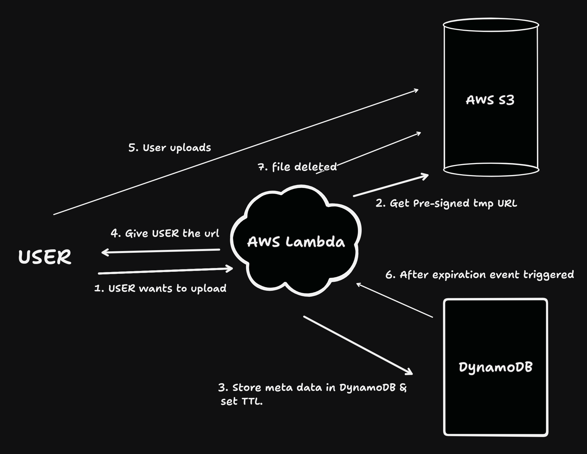

# Secure Event-Driven File Sharing System

## User Stories

### 1. Secure Client Document Drops (Legal & Financial)

Accountants, lawyers, and mortgage brokers constantly need clients to send them highly sensitive documents (like tax returns, passports, or bank statements).

### 2. Premium Digital Downloads (E-Commerce)

Independent creators selling massive 5GB video courses or digital software packages face piracy challenges.

### 3. Large File Transfer Services (The "WeTransfer" Model)

This architecture is the exact blueprint for services like WeTransfer or Smash, acting essentially as a "Snapchat for files."

### 4. Enterprise Temporary Log Collection

When a user experiences a crash in enterprise software, customer support often requests a "crash dump" or diagnostic log file.

## Use Case: Traditional vs. Modern Serverless Approach

### The Traditional (Naive) Approach

In a traditional, naive approach, developers build a web server that runs constantly on a 24/7 schedule. When a user wants to upload a file, they send the file payload directly to this server. The server holds that massive file in its own memory, processes it, and then explicitly forwards it to a storage drive or database. Furthermore, to handle file expiration, developers have to write a custom script (like a cron job) that runs every hour on that same server to scan the database and delete old files.

### The Current (Modern Serverless) Approach

The modern architecture flips this model on its head by completely removing the middleman server and letting AWS handle the heavy lifting automatically.
When a user wants to share a file, they talk to a serverless "gatekeeper" (an AWS Lambda function). This function generates a temporary S3 Presigned URL and gives it to the user. The user then uploads the heavy file _directly_ to the Amazon S3 storage bucket using that link, completely bypassing the compute layer. Concurrently, the system logs the file's lightweight metadata into a DynamoDB table and sets a Time-to-Live (TTL) expiration timer. When the timer hits zero, the database automatically deletes the record. This deletion acts as an event that triggers another serverless function to permanently wipe the actual file from S3.

### Comparison

| Problem in Naive Approach      | How Your System Solves It                                                                                                                                                                                                                                                                 |
| :----------------------------- | :---------------------------------------------------------------------------------------------------------------------------------------------------------------------------------------------------------------------------------------------------------------------------------------- |
| **The Middleman Bottleneck**   | **Direct Uploads:** When a user wants to upload or download a file, they don't talk to the storage system directly. Instead, they talk to a gatekeeper that hands them a temporary pass (Presigned URL). The user uploads the file directly to S3 using that link.                        |
| **Paying for Idle Time**       | **Serverless Compute:** You won't be setting up a traditional server that runs 24/7. Instead, you'll use AWS services (like AWS Lambda) that only "wake up" and run code when a user actually requests or uploads a file.                                                                 |
| **Manual Polling for Cleanup** | **Event-Driven Automation:** You will set a "TTL" (a countdown timer) on that database record. When the timer hits zero, the database deletes the record automatically. This deletion acts as an event that triggers another piece of code to permanently delete the actual file from S3. |

<!--  -->

## Acceptance Criteria

To consider this Secure Event-Driven File Sharing System complete and functional, the following criteria must be met:

### 1. Infrastructure & Security

- Storage Lockdown:\*\* The Amazon S3 bucket must be created with explicit blocks on all public access to prevent unauthorized viewing or downloading.
- Least-Privilege Access:\*\* IAM (Identity and Access Management) roles must be configured so that system components only possess the absolute minimum permissions required to execute their specific tasks.

### 2. Secure Access Generation

- The Gatekeeper:\*\* The system's compute layer (AWS Lambda) must successfully act as a gatekeeper, checking permissions and returning a temporary S3 Presigned URL to the user.
- Time-Bound Permissions:\*\* The generated Presigned URL must grant precise read/write permissions that automatically expire after a limited time frame (e.g., 15 minutes).

### 3. Direct Storage Interaction

- Direct Uploads/Downloads:\*\* Users must be able to upload or download files directly to and from the S3 bucket using the Presigned URL.
- Compute Bypass:\*\* The file transfer must completely bypass the Lambda function's memory to ensure the serverless compute layer does not become overwhelmed by large files.

### 4. Metadata Persistence

- State Tracking:\*\* Upon generating an upload link, the system must successfully log a lightweight metadata record (e.g., file name, S3 link) into the DynamoDB table.
- TTL Configuration:\*\* Every metadata record must be created with a Time-to-Live (TTL) countdown timer attached to it.

### 5. Automated Resource Cleanup (Event-Driven)

- Record Expiration:\*\* When a record's TTL timer hits zero, the DynamoDB database must automatically delete that specific record.
- **Event Trigger:** The automatic deletion of the database record must generate an event that triggers a secondary Lambda function.
- Permanent Deletion:\*\* The triggered Lambda function must successfully reach into the S3 bucket and permanently delete the physical file, leaving no orphaned resources behind.
