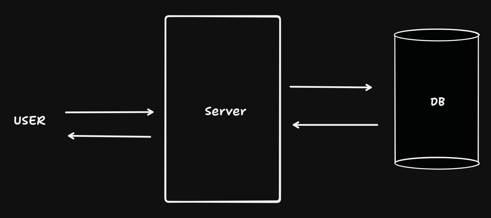

# Secure Event-Driven File Sharing System

The project is a system that allows users to securely share files using temporary web links that automatically self-destruct—along with the files themselves—after a specific amount of time passes.

Imagine a user wants to send massive 2GB video files to friends, which are too large for standard email attachments. In a traditional, naive approach, the user would send the massive file payload directly to a constantly running web server. The server would have to hold that massive file in its own memory and process it before explicitly forwarding it to a storage drive, creating a severe bottleneck that could crash the system if multiple users uploaded heavy files simultaneously. Furthermore, developers would have to write custom scripts, like cron jobs, to manually scan the database and delete old files every hour.

### Thursday, 9 July

## User Stories

### 1. Secure Client Document Drops (Legal & Financial)

Accountants, lawyers, and mortgage brokers constantly need clients to send them highly sensitive documents (like tax returns, passports, or bank statements).

### 2. Premium Digital Downloads (E-Commerce)

Independent creators selling massive 5GB video courses or digital software packages face piracy challenges.

### 3. Large File Transfer Services (The "WeTransfer" Model)

This architecture is the exact blueprint for services like WeTransfer or Smash, acting essentially as a "Snapchat for files."

### 4. Enterprise Temporary Log Collection

When a user experiences a crash in enterprise software, customer support often requests a "crash dump" or diagnostic log file.

## Use Case: Traditional vs. Modern Serverless Approach

### The Traditional (Naive) Approach

In a traditional, naive approach, developers build a web server that runs constantly on a 24/7 schedule. When a user wants to upload a file, they send the file payload directly to this server. The server holds that massive file in its own memory, processes it, and then explicitly forwards it to a storage drive or database. Furthermore, to handle file expiration, developers have to write a custom script (like a cron job) that runs every hour on that same server to scan the database and delete old files.

### The Current (Modern Serverless) Approach

The modern architecture flips this model on its head by completely removing the middleman server and letting AWS handle the heavy lifting automatically.
When a user wants to share a file, they talk to a serverless "gatekeeper" (an AWS Lambda function). This function generates a temporary S3 Presigned URL and gives it to the user. The user then uploads the heavy file _directly_ to the Amazon S3 storage bucket using that link, completely bypassing the compute layer. Concurrently, the system logs the file's lightweight metadata into a DynamoDB table and sets a Time-to-Live (TTL) expiration timer. When the timer hits zero, the database automatically deletes the record. This deletion acts as an event that triggers another serverless function to permanently wipe the actual file from S3.

## How It Works (The Workflow)

Secure Access (The Gatekeeper): When a user wants to upload or download a file, they do not talk to the storage system directly. Instead, they interact with a serverless "gatekeeper" (an AWS Lambda function) that checks their permissions and generates a temporary "pass" called an S3 Presigned URL.

Direct File Transfers: Using the temporary Presigned URL, the user uploads or downloads the heavy file directly to or from an Amazon S3 storage bucket. This completely bypasses the Lambda function's memory, preventing the compute layer from becoming overwhelmed by large files.

Metadata Tracking: While S3 holds the physical files, an Amazon DynamoDB database acts as a "metadata persistence layer". It stores a lightweight index card about the file, which includes the file's name, its S3 link, and a Time-to-Live (TTL) countdown timer.

Event-Driven Automated Cleanup: When the TTL timer hits zero, the database automatically deletes the file's record. This deletion acts as an "event" that triggers a separate Lambda function to reach into the S3 bucket and permanently wipe the actual file.

### Comparison

| Problem in Naive Approach      | How Your System Solves It                                                                                                                                                                                                                                                                 |
| :----------------------------- | :---------------------------------------------------------------------------------------------------------------------------------------------------------------------------------------------------------------------------------------------------------------------------------------- |
| **The Middleman Bottleneck**   | **Direct Uploads:** When a user wants to upload or download a file, they don't talk to the storage system directly. Instead, they talk to a gatekeeper that hands them a temporary pass (Presigned URL). The user uploads the file directly to S3 using that link.                        |
| **Paying for Idle Time**       | **Serverless Compute:** You won't be setting up a traditional server that runs 24/7. Instead, you'll use AWS services (like AWS Lambda) that only "wake up" and run code when a user actually requests or uploads a file.                                                                 |
| **Manual Polling for Cleanup** | **Event-Driven Automation:** You will set a "TTL" (a countdown timer) on that database record. When the timer hits zero, the database deletes the record automatically. This deletion acts as an event that triggers another piece of code to permanently delete the actual file from S3. |

TRADITIONAL

OPTIMAL

## Acceptance Criteria

To consider this Secure Event-Driven File Sharing System complete and functional, the following criteria must be met:

### 1. Infrastructure & Security

- Storage Lockdown:\*\* The Amazon S3 bucket must be created with explicit blocks on all public access to prevent unauthorized viewing or downloading.
- Least-Privilege Access:\*\* IAM (Identity and Access Management) roles must be configured so that system components only possess the absolute minimum permissions required to execute their specific tasks.

### 2. Secure Access Generation

- The Gatekeeper:\*\* The system's compute layer (AWS Lambda) must successfully act as a gatekeeper, checking permissions and returning a temporary S3 Presigned URL to the user.
- Time-Bound Permissions:\*\* The generated Presigned URL must grant precise read/write permissions that automatically expire after a limited time frame (e.g., 15 minutes).

### 3. Direct Storage Interaction

- Direct Uploads/Downloads:\*\* Users must be able to upload or download files directly to and from the S3 bucket using the Presigned URL.
- Compute Bypass:\*\* The file transfer must completely bypass the Lambda function's memory to ensure the serverless compute layer does not become overwhelmed by large files.

### 4. Metadata Persistence

- State Tracking:\*\* Upon generating an upload link, the system must successfully log a lightweight metadata record (e.g., file name, S3 link) into the DynamoDB table.
- TTL Configuration:\*\* Every metadata record must be created with a Time-to-Live (TTL) countdown timer attached to it.

### 5. Automated Resource Cleanup (Event-Driven)

- Record Expiration:\*\* When a record's TTL timer hits zero, the DynamoDB database must automatically delete that specific record.
- **Event Trigger:** The automatic deletion of the database record must generate an event that triggers a secondary Lambda function.
- Permanent Deletion:\*\* The triggered Lambda function must successfully reach into the S3 bucket and permanently delete the physical file, leaving no orphaned resources behind.

---

## Meeting Points

Check on Lifecycle policy

ACCEPTANCE CRITERIA:

1. I want to activate file access after a certain period of time.
2. I want to periodically activate and deactivate the file access.

---

### Thursday, 16 July

---

I compared various alternative tools present in AWS that can be used.

### 1. The Compute Layer (The Gatekeeper)

[This layer handles the logic of authenticating users and generating the temporary upload/download links.]

| Compute Option                    | Pros                                                                                                                 | Cons                                                                                                                       |
| :-------------------------------- | :------------------------------------------------------------------------------------------------------------------- | :------------------------------------------------------------------------------------------------------------------------- |
| **AWS Lambda (Current)**          | Auto-scales instantly. You only pay for exact milliseconds used. Acts as a serverless compute and secure gatekeeper. | "Cold starts" (a slight delay if the function hasn't been used recently). Hard timeout limit of 15 minutes.                |
| **Amazon EC2 (Virtual Machines)** | Total control over the environment. Great for heavy, long-running processing tasks.                                  | You pay for a massive server to run continuously on a 24/7 schedule. You are responsible for security patches and scaling. |
| **Amazon ECS/EKS (Containers)**   | Excellent for running complex, multi-part applications (like Docker). Highly portable.                               | Overkill for simple URL generation. Still requires managing underlying infrastructure or paying a baseline cost.           |

---

### 2. The Storage Layer

[This layer is responsible for physically holding the user's uploaded files.]

| Storage Option                       | Pros                                                                                                                 | Cons                                                                                                                                                                    |
| :----------------------------------- | :------------------------------------------------------------------------------------------------------------------- | :---------------------------------------------------------------------------------------------------------------------------------------------------------------------- |
| **Amazon S3 (Current)**              | Designed specifically for bulk file storage. Incredibly cheap per gigabyte. Has built-in support for Presigned URLs. | Not a traditional file system. If you want to edit a file, you have to overwrite the whole thing.                                                                       |
| **Amazon EFS (Elastic File System)** | Acts like a traditional shared network drive. Multiple servers can read and write to it simultaneously.              | Much more expensive than S3. Does not support native Presigned URLs, meaning your compute layer would have to manually stream every file download (a major bottleneck). |
| **Amazon EBS (Elastic Block Store)** | Lightning fast. Acts like a physical hard drive plugged directly into a server.                                      | Tied to a single EC2 instance. It does not scale infinitely and cannot be easily accessed from the public web.                                                          |

---

### 3. The Metadata Layer (The Database)

[This layer acts strictly as the metadata persistence layer, storing lightweight text records about the files.]

| Database Option               | Pros                                                                                                 | Cons                                                                                                                                                                                    |
| :---------------------------- | :--------------------------------------------------------------------------------------------------- | :-------------------------------------------------------------------------------------------------------------------------------------------------------------------------------------- |
| **Amazon DynamoDB (Current)** | Serverless and blazing fast. Has a native Time-to-Live (TTL) feature for automated resource cleanup. | Has a strict 400 KB size limit per record. Not designed for complex relational queries (like "show me all users who shared files with user X in the last week").                        |
| **Amazon RDS (SQL Database)** | Perfect for complex relationships (Users, Groups, Permissions, etc.). Standardized SQL querying.     | Requires a running instance (not truly serverless). No native TTL feature, meaning you would have to write a custom script (like a cron job) to scan the database and delete old files. |

---

## Functional Requirments:

### Time & Expiration Controls

- Expire the file link immediately after it has been downloaded exactly once (a "burn-after-reading" feature).
- Manually revoke access to the file and delete it before the scheduled Time-to-Live (TTL) countdown timer expires.
- Extend the TTL expiration timer if the recipient needs more time to download the file.
- Schedule a file to only become available for download at a specific future date and time.
- Periodically activate and deactivate the file access on a specific recurring schedule.

### Security & Access Control

- Protect the temporary download link with a custom password that the recipient must enter.
- Restrict the file download to a specific IP address or a specific geographic location.
- Require the recipient to verify their email address via a one-time passcode (OTP) before the download begins.

### Notifications & Auditing

- Receive an email notification the exact moment the recipient successfully downloads the file.
- Receive an alert if the file's TTL expires without the file ever being downloaded.
- Retain lightweight metadata (e.g., upload timestamp, downloader IP, file name) for audit logs, even after the physical file is permanently wiped from the S3 bucket.

### Upload Constraints & Usability

- Restrict uploads to specific file types (e.g., only PDFs or images) to prevent malicious scripts from entering the system.
- Set a maximum file size limit (e.g., 2GB) on the generated S3 Presigned URL to prevent users from uploading files that are too large.
- Generate a single temporary link that allows a user to upload multiple files into a grouped folder.

---

## Meeting Points

- Start with Uploading User, next receiving user
- Specify the limitation like specific file type, max size, etc

---
