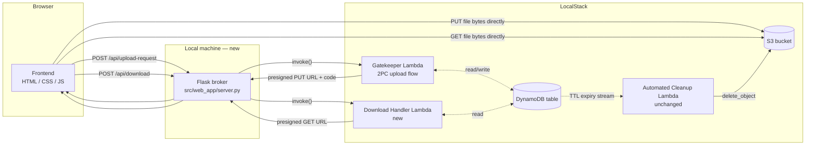

# Web GUI — System Design Decisions

This document records the design choices, tradeoffs, and rationale behind the
manual file-sharing web interface built on top of the existing serverless
backend (Gatekeeper Lambda, Automated Cleanup Lambda, S3, DynamoDB).

It complements `DESIGN.md` (the visual style reference) and `docs/TIMELINE.md`
(the project's original requirements/brainstorm log).

---

## 1. Goal

Give a human a GUI to:

1. Upload a file of their choice.
2. Choose how long it should live.
3. Get a short code to share with someone else.
4. Let that other person download the file with the code, as long as it
   hasn't expired.

For this phase, sender and receiver are the same laptop — no real network
transport between two machines is implemented yet (see [§8](#8-known-limitations--future-work)).

---

## 2. Architecture



Two new/changed components were added; everything else (2PC upload logic,
TTL-driven cleanup) is untouched:

| Component | Status |
|---|---|
| `src/gatekeeper_api/app.py` | **Modified** — share code generation only |
| `src/download_handler/app.py` | **New** — Lambda that validates a code and issues a presigned GET URL |
| `src/automated_cleanup/app.py` | Unchanged |
| `src/web_app/server.py` | **New** — Flask broker; serves the frontend and proxies two endpoints to Lambda |
| `src/web_app/templates/`, `src/web_app/static/` | **New** — frontend |
| `scripts/01_setup_s3.sh` | **Modified** — adds CORS + idempotent bucket creation |
| `scripts/03_deploy_lambdas.sh` | **Modified** — also deploys the download handler |
| `scripts/04_run_web_app.sh` | **New** — convenience runner |

---

## 3. Key Design Decisions

### 3.1 The share code *is* the `file_id` (Option A, not a separate GSI)

**Decision:** The gatekeeper no longer generates a `uuid.uuid4()` string.
Instead it generates an 8-character code from a 32-symbol alphabet
(`ABCDEFGHJKMNPQRSTUVWXYZ23456789` — ambiguous characters `0/O`, `1/I/L`
removed) and uses that **same code** as the DynamoDB partition key
(`file_id`) and the S3 object key suffix (`uploads/<code>`).

**Alternative considered:** Keep the UUID as the internal `file_id`, add a
separate short `share_code` attribute, and add a DynamoDB Global Secondary
Index (GSI) on `share_code` so the download handler can look codes up
efficiently without a UUID.

**Why Option A won:**
- No schema/infrastructure changes (no GSI to provision, no eventual
  consistency lag from GSI replication).
- Lookup is a single `get_item` by primary key — the fastest and cheapest
  DynamoDB read available.
- Simpler code: one identifier, one meaning, everywhere in the system.

**Tradeoff accepted:** Collision risk. With 32 symbols and 8 characters
there are 32⁸ ≈ 1.1 × 10¹² possible codes. For a personal demo project this
is effectively zero risk. If a collision ever did occur, it's not silent
data corruption — the existing 2PC `ConditionExpression="attribute_not_exists(file_id)"`
guard in Phase 1b (see the gatekeeper source) causes that specific request
to fail cleanly with a 503, and the client can simply retry to get a new
code. At real-world scale (millions of concurrent live files) this
approach would need to move to Option B or a longer code.

### 3.2 Download links are reusable, not burn-after-read

**Decision:** Anyone with a valid, unexpired code can request a fresh
presigned download URL as many times as they want until the file's TTL
expires.

**Alternative considered:** Invalidate the code (or flip a `downloaded`
flag) the first time it's used, matching the original brainstorm doc's
"Snapchat for files" burn-after-reading idea (`docs/TIMELINE.md`).

**Why reusable won:** It was the explicit requirement for this iteration,
and it keeps the download handler stateless and side-effect-free (a pure
read). Burn-after-read would require the download handler to *write* to
DynamoDB on every download attempt, reintroducing a distributed-write
consistency problem symmetrical to the upload path's 2PC — deliberately
scoped out for now.

**Future work:** Burn-after-read could be added later as a
`ConditionExpression`-guarded `update_item` (e.g. set `status=CONSUMED`)
inside the download handler, immediately before generating the presigned
URL, using the same conditional-write pattern already proven in the
gatekeeper's Phase 2 commit.

### 3.3 Expiration is explicitly re-validated in the download handler

**Decision:** The download handler does not treat "the DynamoDB record
still exists" as proof that a file is still valid. It explicitly compares
`item["expires_at"]` against the current time on every single download
request, and returns `410 Gone` if that timestamp has passed — regardless
of whether DynamoDB has physically deleted the record yet.

**Why this matters:** We proved empirically (see project history) that
LocalStack's DynamoDB TTL background sweep can lag by up to 60 minutes,
and even real AWS DynamoDB TTL deletion is typically "within minutes" but
is not instantaneous and is not SLA-guaranteed for a specific moment. If
the download handler trusted "record exists ⇒ valid," a file could remain
downloadable for up to an hour (or longer) past its advertised expiration
time, silently violating the feature's core promise.

This is the single most important correctness guarantee in this feature:
**the application layer enforces expiration on every read, independent of
the infrastructure's cleanup timing.**

### 3.4 A local Flask server brokers all Lambda calls — the browser never touches AWS directly

**Decision:** The browser never holds AWS credentials and never calls
`boto3`/AWS SDK-for-JS directly. It only ever calls two same-origin JSON
endpoints (`POST /api/upload-request`, `POST /api/download`) on the Flask
app, which in turn invokes the Lambda functions using `boto3` on the
server side.

**Why:** Even in a local demo, this mirrors real-world best practice —
credentials (even LocalStack's dummy `test`/`test` pair) should never ship
to client-side JavaScript. It also means swapping LocalStack for real AWS
later requires zero frontend changes; only the Flask server's environment
variables change.

**What Flask does *not* do:** It never proxies file bytes. It only ever
returns presigned URLs. The actual upload (`PUT`) and download (`GET`)
requests go **directly from the browser to S3** (LocalStack), exactly like
the original CLI-based demo. This preserves the project's original
architectural principle — bypass the compute layer for large payloads —
even in the browser-based flow.

### 3.5 CORS is wide open (`*`) for this phase only

**Decision:** `scripts/01_setup_s3.sh` configures the bucket's CORS policy
to accept `GET`/`PUT`/`HEAD` from any origin (`scripts/cors-config.json`).

**Why:** The browser (served from the Flask app, e.g. `http://localhost:5000`)
and LocalStack S3 (`http://localhost:4566`) are different origins, so the
browser's `fetch`/`XMLHttpRequest` calls to upload/download would otherwise
be blocked by the browser's CORS policy. Since sender and receiver are the
same laptop and nothing is exposed beyond `localhost`, an open CORS policy
carries no meaningful risk right now.

**Must change before any real deployment:** `AllowedOrigins` should be
pinned to the exact origin(s) the frontend is actually served from.

### 3.6 Short-lived presigned GET URL, decoupled from the file's share-expiration timer

**Decision:** The download handler's presigned URL itself expires in 60
seconds (`DOWNLOAD_URL_TTL_SECONDS`) — a completely separate value from the
file's overall share lifetime (the `expiration_seconds` the sender chose,
which can be minutes to a day).

**Why:** These are two different concerns. The 60-second window only needs
to cover the gap between "Lambda returns a URL" and "browser starts the
GET request," which happens automatically and near-instantly in JS. It
does **not** limit how long the download itself can take once started —
once S3 begins streaming a response to an already-authorized request, the
presigned URL's expiry has no further effect on that in-flight transfer.

### 3.7 Frontend is vanilla HTML/CSS/JS, no build step

**Decision:** No React/Vue/bundler was introduced, even though the option
was on the table.

**Why:** The rest of the project has zero JavaScript tooling (no
`package.json`, no Node dependency). A framework would add a build
pipeline, `node_modules`, and a compile step for a UI that is two small
forms and some fetch calls. `DESIGN.md`'s tokens (colors, type scale,
spacing, radii) translate directly into plain CSS custom properties with
no loss of fidelity. This keeps the whole project runnable with just
Python + a browser.

### 3.8 One pragmatic deviation from `DESIGN.md`: the dropzone has a visible outline

**Decision:** The file dropzone (`.dropzone` in `style.css`) uses a 1px
dashed `Ash Gray` border.

**Why this technically breaks a stated rule:** `DESIGN.md`'s "Don't"
section says: *"Do not introduce card containers with borders, shadows, or
background fills — elements float on black with whitespace alone."*

**Why it was kept anyway:** A drag-and-drop file target with **zero**
visual boundary is not usable — users cannot tell where to drop a file or
that a clickable/droppable region exists at all. The outline (not a filled
surface, no shadow, no elevation) is the smallest possible deviation: it
borrows the design system's own "outlined shapes over filled surfaces"
language (the brand's signature particles are themselves "outlined, 1–2px
stroke" per `DESIGN.md` §Imagery) rather than introducing a card. Every
other component in the UI (buttons, headline blocks, result panels)
follows the no-border/no-shadow/no-card rule exactly.

### 3.9 The Flask server runs as a plain local process, not containerized

**Decision:** `scripts/04_run_web_app.sh` just runs `python server.py`
directly — it is not added to `docker-compose.yml`.

**Why:** This is a GUI demo convenience layer on top of the "real"
infrastructure (LocalStack). Keeping it as a simple local process avoids
adding Docker networking complexity (the Flask container would need to
reach the LocalStack container's internal network) for no real benefit at
this stage. It can be containerized later if/when this needs to run
somewhere other than a developer's laptop.

---

## 4. Data Model Change

| Field | Before | After |
|---|---|---|
| `file_id` | `uuid4()`, e.g. `9a70e845-03ac-4535-8dee-a1d85eaf9b1d` | 8-char code, e.g. `K4J9XQP2` (also serves as the share code) |
| `filename`, `s3_key`, `expires_at`, `status`, `created_at` | unchanged | unchanged |

No migration was needed — the `automated_cleanup` Lambda reads `file_id`
generically as a string and never assumed UUID formatting.

---

## 5. API Contract (Flask broker)

### `POST /api/upload-request`
Request:
```json
{ "filename": "report.pdf", "expiration_seconds": 900 }
```
Response `200`:
```json
{
  "message": "Secure upload link generated successfully",
  "file_id": "K4J9XQP2",
  "upload_url": "http://localhost:4566/secure-file-share-bucket/uploads/K4J9XQP2?...",
  "expires_in_seconds": 900
}
```
Errors: `503` if S3/DynamoDB is unreachable or the 2PC commit fails (see
gatekeeper source for the exact failure/rollback matrix).

### `POST /api/download`
Request:
```json
{ "code": "K4J9XQP2" }
```
Response `200`:
```json
{
  "filename": "report.pdf",
  "download_url": "http://localhost:4566/secure-file-share-bucket/uploads/K4J9XQP2?...",
  "expires_at": 1785500693,
  "seconds_remaining": 412
}
```
Errors:
- `400` — missing code
- `404` — code doesn't exist, or record isn't `ACTIVE` (still `PENDING` /
  rolled back), or the S3 object is unexpectedly missing
- `410` — code exists but `expires_at` has passed (this is the enforced
  expiration path — see [§3.3](#33-expiration-is-explicitly-re-validated-in-the-download-handler))
- `503` — S3/DynamoDB unreachable

---

## 6. How to Run

```bash
# 1. Start LocalStack (if not already running)
docker compose up -d

# 2. Provision infra (idempotent — safe to re-run)
./scripts/01_setup_s3.sh
./scripts/02_setup_dynamodb.sh

# 3. Deploy/redeploy all three Lambdas
./scripts/03_deploy_lambdas.sh

# 4. Run the web app
./scripts/04_run_web_app.sh
# Open http://localhost:5000
```

Since sender and receiver are the same laptop for this phase, open the
same URL in two browser tabs (or one tab, switching between the Send/
Receive toggle) to try the full round trip.

---

## 7. Security Notes (demo-scope, not production-hardened)

- No authentication on either Flask endpoint — anyone who can reach
  `localhost:5000` can request uploads or attempt codes.
- No rate limiting on `/api/download` — an 8-character code space is large
  (§3.1) but not rate-limit-protected, so brute-forcing isn't
  cryptographically infeasible the way a rate-limited system would make it.
  Acceptable for a local demo; would need addressing before any public
  exposure.
- No file type/size restrictions are enforced (the original brainstorm doc
  in `docs/TIMELINE.md` flagged this as a nice-to-have; still not
  implemented).
- No virus/malware scanning of uploaded content.

## 8. Known Limitations / Future Work

- Sender and receiver are the same machine; there's no real network
  handoff of the code (e.g. email, SMS) yet.
- No "burn after reading" mode (§3.2).
- No upload cancellation UI (if a user closes the tab mid-upload, the
  gatekeeper's `PENDING` record and its TTL will still expire and be
  swept normally — no orphaned resource, just a slightly awkward UX).
- No UI list of "my active shares" — a sender who loses their code has no
  way to recover it (would need to scan DynamoDB or add a session concept).
- CORS is wide open; needs origin-pinning before any non-localhost use.
